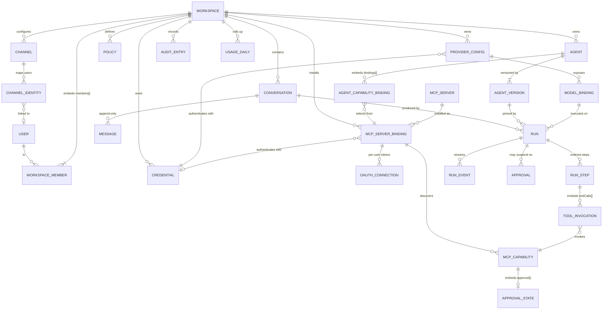

# Data Model — MongoDB Atlas

Companion to [../ARCHITECTURE.md](../ARCHITECTURE.md). Defines every collection, document shape,
index, and relationship.

**Database:** MongoDB Atlas (replica set — always, on Atlas), MongoDB **8.1+** required
(`$rankFusion` for Phase 2 hybrid search). Local and CI run the `mongo:8.3` image —
MongoDB's rapid releases skip some Docker tags, and there is no `8.1` image.
**Driver:** official `mongodb` Node.js driver **7.x**. No ODM — see §0.2.

---

## 0. Modelling principles

### 0.1 Designed for MongoDB, not translated from SQL

This model was designed from **access patterns**, not by renaming tables. Concretely, that means:

| Relational instinct | What we do instead | Why |
|---|---|---|
| `workspace_members` join table | **Embed `members[]` in the `workspaces` document** | Authorization is the hottest path in the system. Embedding makes "who is this user in this workspace, and what role" a **single document read**, indexed on `members.userId`. |
| `tool_permissions` rows | **One `policies` document per scope, holding a `rules[]` array** | Policy evaluation needs *all* rules for a scope at once. One read, not N. |
| `mcp_capability_approvals` join table | **Embed `approval{}` on the capability document** | Approval is meaningless apart from the capability. Embedding makes `approval.definitionHash !== definitionHash` a self-invalidating check with **no join and no cross-document race**. |
| `agent_versions` FK from `runs` | **Embed a compact `agentSnapshot` in the run** | A run must stay reproducible and explainable even if the agent is edited or deleted. |
| `outbox` table + Redis | **The `runs` collection *is* the work queue** (lease-based claim) | Removes an entire component. See §3.2 — this is why Phase 1 needs no Redis at all. |
| `usage_records` row per call | `run.usage` (truth) + **`usageDaily` rollup upserted with `$inc`**| Billing reads a rollup, not a scan. |
| Separate `document_chunks` + per-dimension embedding tables | **`embeddings` sub-document keyed by model, one Atlas vector index per path** | Atlas indexes a *path*, so multiple embedding models coexist in one collection. This is strictly better than pgvector's fixed-dimension column problem. |

### 0.2 Why the official driver and no ODM

Requirement: official driver unless there is a *compelling architectural reason* otherwise.
There is not one here, and there is a compelling reason against an ODM:

- Our domain layer already owns its types (`packages/core`). A Mongoose schema would be a **second,
  competing definition** of the same entities, and the two drift.
- Every document leaves the data layer through a **mapper** into a domain object anyway (§0.4), so
  an ODM's hydration buys nothing and costs a runtime dependency.
- The `ScopedCollection` wrapper (§0.3) must intercept *every* command to enforce tenancy. Wrapping
  the raw driver `Collection` is direct; wrapping an ODM's query builder is not.
- Validation belongs at the boundary (Zod, on input) and at the database (JSON Schema validators,
  §0.5) — not in a middle layer that enforces it only for writes that happen to go through it.

The driver's aggregation pipeline, change streams, `findOneAndUpdate`, bulk writes and
`$vectorSearch` are all used directly. No abstraction is lost.

### 0.3 Tenant scoping — the only access path

`packages/db` exports **no raw driver objects**. Everything goes through:

```ts
// The ONLY way application code touches MongoDB.
interface ScopedCollection<T> {
  findOne(filter, options?):      Promise<T | null>;
  find(filter, options?):         FindCursor<T>;
  insertOne(doc):                 Promise<T>;           // stamps workspaceId
  updateOne(filter, update, o?):  Promise<UpdateResult>;
  aggregate(pipeline):            AggregationCursor;    // prepends { $match: { workspaceId } }
  // ...
}

interface ScopedDb {
  readonly workspaceId: WorkspaceId;
  collection<K extends TenantCollection>(name: K): ScopedCollection<DocOf<K>>;
}
```

- Every filter is merged with `{ workspaceId }`. Every insert is stamped with it.
- Every aggregation pipeline is **prefixed** with `{ $match: { workspaceId } }` — a pipeline cannot
  begin with `$lookup`, `$unionWith`, `$search`, or `$vectorSearch` without that gate.
- `$lookup` and `$unionWith` sub-pipelines must also carry a `workspaceId` match; the wrapper
  rejects any that do not.
- A deliberate escape hatch exists — `unsafeUnscoped(reason: string)` — which is greppable, audited,
  and permitted only in migrations and platform-catalog reads.

**MongoDB has no row-level security.** This is a real, acknowledged reduction in *structural*
guarantee compared to a PostgreSQL RLS design. It is compensated by the runtime guard in §0.6,
which is mechanised rather than aspirational. See `SECURITY.md` risk **R4**.

### 0.4 Document ↔ domain mapping

- Stored `_id` is a `string` (UUIDv7, time-sortable) — **not** `ObjectId`. Rationale: IDs cross into
  URLs, logs, provider payloads and MCP arguments; a plain sortable string avoids BSON leakage into
  the domain and keeps `packages/core` free of any driver type.
- Timestamps are BSON `Date`.
- Money is stored as `Decimal128` for cost fields; token counts are `int`.
- Each collection has `toDomain()` / `toDocument()` mappers in `packages/db/src/mappers`. Domain
  objects never carry `_id`; they carry `id`.

### 0.5 Schema validation at the database

Every collection is created with a `$jsonSchema` validator (`validationLevel: "strict"`,
`validationAction: "error"`). The database is the last line of defence against a malformed write
from a code path that skipped Zod. Validators are generated from the same Zod schemas, so there is
one source of truth.

### 0.6 The tenancy guard (mechanised, not aspirational)

The MongoDB Node driver supports **command monitoring**. We enable `monitorCommands: true` and
subscribe to `commandStarted`:

```
On every command against a tenant-scoped collection:
  inspect the command's filter / pipeline / update
  if it does not constrain workspaceId → VIOLATION
    dev / test / CI  → throw (build fails)
    production       → log CRITICAL + audit + alert (configurable to throw)
```

This catches an unscoped query **regardless of which code path produced it**, including one that
bypassed `ScopedCollection` entirely. It is the closest mechanical equivalent to RLS available on
MongoDB, and it is a Phase 1 deliverable, not a later hardening task.

### 0.7 Transactions — used sparingly, by design

Atlas clusters are replica sets, so multi-document ACID transactions are available. We still avoid
them on hot paths by making multi-write operations **idempotent** rather than atomic:

- A user message's `_id` is derived deterministically from `(conversationId, clientMessageId)`, so a
  retry re-inserts the same `_id` and fails harmlessly on duplicate key.
- A run carries `idempotencyKey` with a unique index, so a retried submission returns the existing
  run.
- Approval decision → run resumption is a **single-document** update on `runs`.

Transactions are reserved for genuinely multi-aggregate invariants (workspace deletion cascades,
credential rotation). Each use is documented at the call site with the invariant it protects.

---

## 1. Entity-relationship overview



**Phase 2+ (designed, not built):** `COLLECTION ||--o{ DOCUMENT ||--o{ DOCUMENT_CHUNK`, and
`MEMORY_ENTRY`, both with Atlas Vector Search indexes.

---

## 2. Collections — identity, tenancy, access

### 2.1 Better Auth collections (`user`, `session`, `account`, `verification`)

Owned by `@better-auth/mongo-adapter`. **We do not redefine or hand-edit them.** Our code reads
`user` for display purposes and treats `user._id` as the global user identifier. Better Auth
manages its own indexes; we add none.

> Consequence: `users` are **global**, not tenant-scoped. They are excluded from the tenancy guard.

### 2.2 `workspaces`

```jsonc
{
  "_id": "wks_01J...",
  "slug": "acme",                                  // unique, URL-safe
  "name": "Acme Corp",
  "plan": "pro",
  "settings": {
    "defaultToolEffect": "ask",                    // fail-closed default for PermissionBroker
    "maxConcurrentRuns": 5,
    "dailyCostCapUsd": { "$numberDecimal": "50.00" },
    "allowedMcpTrustTiers": ["first_party", "verified"]
  },
  "members": [                                     // EMBEDDED — hot authorization path
    { "userId": "usr_...", "role": "owner",  "status": "active",
      "joinedAt": ISODate, "invitedBy": null },
    { "userId": "usr_...", "role": "member", "status": "active",
      "joinedAt": ISODate, "invitedBy": "usr_..." }
  ],
  "invitations": [
    { "id": "inv_...", "email": "x@y.com", "role": "member",
      "tokenHash": "…", "invitedBy": "usr_...", "expiresAt": ISODate }
  ],
  "createdBy": "usr_...", "createdAt": ISODate, "updatedAt": ISODate,
  "deletedAt": null
}
```

**Indexes**
```
{ slug: 1 }                          unique
{ "members.userId": 1 }              multikey — "list my workspaces" + authz lookup
{ "invitations.tokenHash": 1 }       sparse, unique
```

**Bound:** `members` is capped at 500. Beyond that the workspace migrates to a separate
`workspaceMembers` collection; the repository interface does not change, so this is an internal
migration. Documented so nobody discovers the cap in production.

**Concurrency:** membership edits use `$push`/`$pull`/`$set` with an arrayFilter on `members.userId`
— never read-modify-write of the whole array.

### 2.3 `apiKeys`

```jsonc
{
  "_id": "key_...", "workspaceId": "wks_...",
  "name": "CI integration",
  "prefix": "sk_live_a1b2c3",                      // indexed lookup handle
  "keyHash": "<sha256 of full secret>",            // constant-time compared
  "scopes": ["runs:create", "conversations:read"],
  "createdBy": "usr_...", "createdAt": ISODate,
  "lastUsedAt": ISODate, "expiresAt": null, "revokedAt": null
}
```
**Indexes:** `{ prefix: 1 }` unique · `{ workspaceId: 1, revokedAt: 1 }`

---

## 3. Collections — execution core

### 3.1 `conversations`

```jsonc
{
  "_id": "cnv_...", "workspaceId": "wks_...",
  "agentId": "agt_...",
  "channelId": "chn_...", "externalRef": null,     // channel-side thread id, for idempotency
  "title": "Quarterly numbers",
  "status": "active",                              // active | archived
  "messageCount": 42,
  "nextSeq": 43,                                   // monotonic allocator, $inc
  "lastMessage": {                                 // DENORMALISED for list views
    "role": "assistant", "preview": "Here are the…", "at": ISODate
  },
  "compaction": { "upToSeq": 18, "summaryMessageId": "msg_..." },
  "modelBindingId": "mbd_...",                     // current binding; MAY CHANGE MID-CONVERSATION
  "createdBy": "usr_...", "createdAt": ISODate, "updatedAt": ISODate
}
```
**Indexes**
```
{ workspaceId: 1, updatedAt: -1 }
{ workspaceId: 1, agentId: 1, updatedAt: -1 }
{ channelId: 1, externalRef: 1 }     unique, sparse   — channel idempotency
```

### 3.2 `messages` — append-only, provider-independent

This is the collection that makes requirement 11 (one conversation across three providers) work.

```jsonc
{
  "_id": "msg_...",                                // deterministic for user msgs (see §0.7)
  "workspaceId": "wks_...", "conversationId": "cnv_...",
  "seq": 17,                                       // dense, monotonic within conversation
  "role": "assistant",                             // user | assistant | tool | system
  "runId": "run_...",

  "content": [                                     // CANONICAL blocks — never provider wire format
    { "type": "text", "text": "I'll check that." },
    { "type": "tool_use", "id": "tu_1",
      "name": "gmail__list_messages", "input": { "q": "after:2026-09-01" } }
  ],

  "providerArtifacts": {                           // OPAQUE, keyed by provider:model
    "anthropic:claude-opus-5": { "blocks": [ /* verbatim thinking blocks + signatures */ ] }
  },

  "tokens": { "estimate": 412 },
  "createdAt": ISODate,
  "supersededBy": null                             // edits append + tombstone; never mutate
}
```

**Replay rule (enforced in the provider adapter, never in the runtime):**
- artifact key === current `provider:model` → replay **verbatim and unmodified**
- otherwise → **drop** the artifact; send only canonical `reasoning` summaries

**Indexes**
```
{ conversationId: 1, seq: 1 }        unique       — window reads + gap detection
{ workspaceId: 1, createdAt: -1 }
{ runId: 1 }                         sparse
```

**Size discipline:** a message exceeding 512 KB has oversized blocks spilled to blob storage and
replaced by `{ type: "blob_ref", key, bytes, mime }`. The 16 MB BSON limit is never approached.

### 3.3 `runs` — the state machine **and** the work queue

The single most load-bearing document in the system. It is simultaneously:
the run's state, its budget ledger, its lease record, and its queue entry.

```jsonc
{
  "_id": "run_...", "workspaceId": "wks_...",
  "conversationId": "cnv_...",

  "agentVersionId": "agv_...",
  "agentSnapshot": {                               // EMBEDDED — run stays reproducible forever
    "systemPrompt": "…", "modelRole": "chat",
    "capabilitySelection": [ /* … */ ], "guardrails": { /* … */ }
  },
  "modelBindingId": "mbd_...",
  "providerKey": "anthropic:claude-opus-5",        // what actually served it

  "trigger": { "type": "user", "ref": "usr_..." }, // user | api | channel | schedule | agent
  "principal": { /* snapshot of the acting principal + effective grants */ },

  "status": "running",
  // queued | running | waiting_approval | waiting_input | waiting_tool
  // | succeeded | failed | cancelled | expired

  // ── QUEUE FIELDS (§3.2 rationale) ────────────────────────────────
  "priority": 10,
  "scheduledFor": ISODate,                         // now, or a continuation backoff
  "lease": { "owner": "vercel:iad1:abc", "until": ISODate, "token": "lse_..." },
  "attempts": 2,
  "continuation": { "fromStep": 7, "reason": "deadline" },   // set by SlicedExecutor

  "budget": { "maxSteps": 24, "maxToolCalls": 48, "maxTotalTokens": 400000,
              "maxWallClockMs": 900000, "maxCostUsd": {"$numberDecimal":"2.00"},
              "maxMrtrRounds": 4, "maxSubagentDepth": 2 },
  "consumed": { "steps": 7, "toolCalls": 9, "tokens": 88412, "wallClockMs": 41233,
                "costUsd": {"$numberDecimal":"0.4131"} },

  "usage": { "inputTokens": 71200, "cacheReadTokens": 64000,
             "cacheWriteTokens": 2100, "outputTokens": 17212 },

  "nextStepSeq": 8,
  "parentRunId": null, "depth": 0,
  "idempotencyKey": "chn:tg:1234:5678",
  "error": null,
  "queuedAt": ISODate, "startedAt": ISODate, "finishedAt": null,
  "heartbeatAt": ISODate
}
```

**The atomic claim** — no Redis, no outbox, no separate queue component:

```js
db.runs.findOneAndUpdate(
  { workspaceId: { $in: allowedWorkspaces },        // fair-share / tenant isolation
    status: "queued",
    scheduledFor: { $lte: now },
    $or: [ { "lease.until": { $exists: false } }, { "lease.until": { $lt: now } } ] },
  { $set:  { status: "running", startedAt: now, heartbeatAt: now,
             lease: { owner: workerId, until: now + leaseMs, token: newToken } },
    $inc:  { attempts: 1 } },
  { sort: { priority: -1, scheduledFor: 1 }, returnDocument: "after" }
)
```

Crash safety is free: the lease expires and another executor reclaims the run at its **persisted
step boundary**. Every subsequent write is guarded by `"lease.token": myToken`, so a zombie executor
whose lease was stolen cannot write — this is what prevents duplicate tool side effects.

**Indexes**
```
{ status: 1, scheduledFor: 1, priority: -1 }      — the claim index (NOT workspace-prefixed;
                                                     queue polling is a platform operation)
{ workspaceId: 1, status: 1, queuedAt: -1 }       — UI "my runs"
{ workspaceId: 1, conversationId: 1, queuedAt: -1 }
{ workspaceId: 1, idempotencyKey: 1 }             unique, sparse
{ "lease.until": 1 }                              sparse — stalled-run sweeper
{ parentRunId: 1 }                                sparse
```

### 3.4 `runSteps`

```jsonc
{
  "_id": "stp_...", "workspaceId": "wks_...", "runId": "run_...",
  "seq": 7,
  "type": "tool_call",
  // model_call | tool_call | compaction | input_required | memory_write | subagent
  "status": "succeeded",

  "request":  { "summary": { /* compact */ }, "blobKey": "runs/run_.../step-7-req.json" },
  "response": { "summary": { /* compact */ }, "blobKey": "…" },

  "toolCalls": [                                   // EMBEDDED — always read with the step
    { "id": "tu_1",
      "bindingId": "mbd_...", "capabilityName": "gmail__list_messages",
      "argumentsRedacted": { "q": "after:2026-09-01" },
      "permissionDecision": { "effect": "allow", "matchedRuleId": "rul_...",
                              "approvalId": null },
      "resultRef": { "blobKey": "…", "bytes": 84210 },
      "isError": false, "mrtrRounds": 0, "mcpTaskId": null, "durationMs": 812 }
  ],

  "usage": { "inputTokens": 0, "outputTokens": 0 },
  "latencyMs": 830,
  "startedAt": ISODate, "finishedAt": ISODate
}
```
**Indexes:** `{ runId: 1, seq: 1 }` unique · `{ workspaceId: 1, "toolCalls.capabilityName": 1, startedAt: -1 }`

### 3.5 `runEvents` — the streaming spine

```jsonc
{
  "_id": "evt_...", "workspaceId": "wks_...", "runId": "run_...",
  "seq": 219,
  "type": "text_delta",
  // run_started | step_started | text_delta | reasoning_delta | tool_call_started
  // | tool_call_finished | approval_requested | run_suspended | run_finished | error
  "payload": { "text": "Here are the" },
  "createdAt": ISODate
}
```
**Indexes:** `{ runId: 1, seq: 1 }` unique · `{ createdAt: 1 }` **TTL 30 days**

This collection is how the browser sees a run it is not executing. The SSE endpoint tails it via a
**change stream** (Atlas is always a replica set, so change streams are available), falling back to
cursor polling. That decoupling is what lets execution move to a worker without the frontend
noticing — see `DEPLOYMENT.md` §4.

### 3.6 `approvals`

```jsonc
{
  "_id": "apr_...", "workspaceId": "wks_...",
  "runId": "run_...", "runStepSeq": 7,
  "kind": "tool_call",                             // tool_call | mrtr_input | budget_increase
  "payload": {
    "capabilityName": "gmail__send_message",
    "argumentsRedacted": { "to": "…", "subject": "…" },
    "bindingAlias": "gmail", "trustTier": "verified",
    "reason": "policy:ask", "matchedRuleId": "rul_..."
  },
  "requestedAt": ISODate, "expiresAt": ISODate,
  "decision": null,                                // approve | deny | null
  "decidedBy": null, "decidedAt": null,
  "response": null,                                // MRTR inputResponses when kind=mrtr_input
  "remember": null                                 // { scope, ttlMs, argConstraints }
}
```
**Indexes:** `{ workspaceId: 1, decision: 1, requestedAt: -1 }` · `{ runId: 1 }` · `{ expiresAt: 1 }` TTL

---

## 4. Collections — agents and providers

### 4.1 `agents`

```jsonc
{
  "_id": "agt_...", "workspaceId": "wks_...",
  "slug": "research-assistant", "name": "Research Assistant",
  "description": "…",
  "currentVersion": {                              // EMBEDDED — single-read resolution
    "versionId": "agv_...", "version": 7,
    "systemPrompt": "…",
    "modelRole": "chat",
    "budgetProfile": "standard",
    "capabilityBindings": [                        // EMBEDDED — MCP server REUSE lives here
      { "bindingId": "mbd_gmail",  "mode": "allow",
        "tools": ["list_messages", "get_message"] },
      { "bindingId": "mbd_linear", "mode": "all", "tools": [] }
    ],
    "guardrails": { "maxToolCallsPerTurn": 6 }
  },
  "isArchived": false,
  "createdBy": "usr_...", "createdAt": ISODate, "updatedAt": ISODate
}
```
**Indexes:** `{ workspaceId: 1, slug: 1 }` unique · `{ workspaceId: 1, isArchived: 1, updatedAt: -1 }`

### 4.2 `agentVersions` — immutable history

```jsonc
{ "_id": "agv_...", "workspaceId": "wks_...", "agentId": "agt_...",
  "version": 7, "snapshot": { /* identical shape to currentVersion */ },
  "changelog": "Added Linear binding", "createdBy": "usr_...", "createdAt": ISODate }
```
**Indexes:** `{ agentId: 1, version: -1 }` unique

### 4.3 `providerConfigs`

```jsonc
{ "_id": "prv_...", "workspaceId": "wks_...",
  "providerType": "anthropic",        // anthropic | openai | google | openai_compatible | local
  "name": "Anthropic (production)",
  "credentialId": "crd_...",
  "baseUrl": null, "settings": {}, "enabled": true,
  "createdBy": "usr_...", "createdAt": ISODate }
```
**Indexes:** `{ workspaceId: 1, providerType: 1 }` · `{ workspaceId: 1, enabled: 1 }`

### 4.4 `modelBindings` — the vendor-independence pivot

```jsonc
{
  "_id": "mbd_...", "workspaceId": "wks_...", "providerConfigId": "prv_...",
  "modelId": "claude-opus-5",
  "displayName": "Claude Opus 5",
  "role": "chat",                                  // chat | reasoning | summarizer | cheap | embedding
  "params": { "effort": "high", "thinking": "adaptive", "maxOutputTokens": 16000 },
  "capabilities": { /* cached ModelCapabilities — see PROVIDER-ABSTRACTION.md */ },
  "capabilitiesFetchedAt": ISODate,
  "cost": { "inputPerMTok": {"$numberDecimal":"5.00"},
            "outputPerMTok": {"$numberDecimal":"25.00"},
            "cacheReadPerMTok": {"$numberDecimal":"0.50"} },
  "fallbackBindingId": null,                       // provider-level HA, pure configuration
  "enabled": true
}
```
**Indexes:** `{ workspaceId: 1, role: 1, enabled: 1 }` · `{ workspaceId: 1, providerConfigId: 1, modelId: 1, role: 1 }` unique

An agent references a **role**; the workspace maps roles to bindings. Switching every agent from
Anthropic to Google is one document update.

---

## 5. Collections — MCP

### 5.1 `mcpServers` — catalog definitions

```jsonc
{
  "_id": "mcs_...",
  "workspaceId": null,                             // null ⇒ PLATFORM CATALOG (shared)
  "slug": "linear", "name": "Linear",
  "transport": "streamable_http",                  // streamable_http | stdio (Phase 3)
  "url": "https://mcp.linear.app/mcp",
  "command": null, "args": null, "envTemplate": null,
  "authMode": "oauth2",                            // none | oauth2 | header | passthrough
  "authConfig": { "scopes": ["read", "write"] },
  "trustTier": "verified",                         // first_party | verified | community | untrusted
  "protocolVersionPin": null,
  "publisher": "Linear", "createdAt": ISODate
}
```
**Indexes:** `{ workspaceId: 1, slug: 1 }` unique (nulls collate together — platform slugs are unique)

### 5.2 `mcpServerBindings` — a workspace's installation

```jsonc
{
  "_id": "mbd_linear", "workspaceId": "wks_...", "mcpServerId": "mcs_...",
  "alias": "linear",                               // the tool-namespace prefix: linear__create_issue
  "credentialId": null,
  "perUserAuth": true,                             // default for user-facing servers
  "configOverrides": {},
  "status": "connected",                           // pending_auth | connected | error | disabled
  "negotiatedProtocolVersion": "2026-07-28",
  "discovery": { "lastAt": ISODate, "ttlMs": 300000, "cacheScope": "user",
                 "capabilityCount": 14 },
  "health": { "lastOkAt": ISODate, "consecutiveFailures": 0,
              "circuitState": "closed", "lastError": null },
  "enabled": true, "createdBy": "usr_...", "createdAt": ISODate
}
```
**Indexes:** `{ workspaceId: 1, alias: 1 }` unique · `{ workspaceId: 1, enabled: 1 }` · `{ mcpServerId: 1 }`

`alias` uniqueness per workspace is what makes canonical tool names collision-free by construction.

### 5.3 `mcpCapabilities` — with **embedded, self-invalidating approval**

```jsonc
{
  "_id": "cap_...", "workspaceId": "wks_...", "bindingId": "mbd_linear",
  "scopeKey": "workspace",                         // or "user:usr_..." when cacheScope is per-user
  "kind": "tool",                                  // tool | resource | resource_template | prompt
  "name": "create_issue",
  "canonicalName": "linear__create_issue",
  "title": "Create issue", "description": "Creates a Linear issue…",
  "inputSchema":  { /* JSON Schema 2020-12 */ },
  "outputSchema": { /* unrestricted 2020-12 */ },
  "annotations": { "readOnlyHint": false, "destructiveHint": false },

  "definitionHash": "sha256:9f2c…",                // over the NORMALISED definition

  "approval": {                                    // EMBEDDED
    "state": "approved",
    "definitionHash": "sha256:9f2c…",              // ← compared against the field above
    "approvedBy": "usr_...", "approvedAt": ISODate
  },

  "firstSeenAt": ISODate, "lastSeenAt": ISODate, "removedAt": null
}
```

**The rug-pull defence is a field comparison, not a workflow:**

```
isUsable(cap) === cap.approval.state === "approved"
              && cap.approval.definitionHash === cap.definitionHash
```

When discovery writes a new `definitionHash`, approval is invalidated **atomically in the same
update**. There is no window in which a changed tool is still approved, and no join to get wrong.

**Indexes**
```
{ bindingId: 1, scopeKey: 1, kind: 1, name: 1 }   unique
{ workspaceId: 1, bindingId: 1, removedAt: 1 }
{ workspaceId: 1, "approval.state": 1 }            — "pending approval" UI
```

### 5.4 `policies` — one document per scope, `rules[]` inside

```jsonc
{
  "_id": "pol_...", "workspaceId": "wks_...",
  "scopeType": "agent",                            // workspace | agent | member | apiKey | channel
  "scopeId": "agt_...",
  "rules": [
    { "id": "rul_1", "bindingId": "mbd_linear", "capabilityPattern": "*",
      "effect": "allow", "priority": 10,
      "constraints": { "maxCallsPerRun": 20 } },
    { "id": "rul_2", "bindingId": "mbd_gmail", "capabilityPattern": "send_*",
      "effect": "ask",   "priority": 50, "constraints": {} },
    { "id": "rul_3", "bindingId": "*", "capabilityPattern": "*delete*",
      "effect": "deny",  "priority": 100, "constraints": {} }
  ],
  "updatedBy": "usr_...", "updatedAt": ISODate
}
```
**Indexes:** `{ workspaceId: 1, scopeType: 1, scopeId: 1 }` unique

`PermissionBroker` reads **at most 3 documents** (workspace, agent, principal scope) to evaluate any
decision. Deny wins outright; otherwise most-specific/highest-priority wins; no match falls through
to `workspace.settings.defaultToolEffect`, which ships as `ask`.

### 5.5 `credentials` — envelope-encrypted

```jsonc
{
  "_id": "crd_...", "workspaceId": "wks_...",
  "name": "Anthropic production key",
  "kind": "api_key",                               // api_key | oauth2_token | header | basic
  "ciphertext": BinData,                           // AES-256-GCM
  "iv": BinData, "authTag": BinData,
  "wrappedDek": BinData,
  "keyProvider": "local_file",                     // local_file | kms | vault
  "kekVersion": 3,
  "metadata": { "hint": "sk-ant-…XyZ" },           // never the secret
  "createdBy": "usr_...", "createdAt": ISODate,
  "rotatedAt": null, "revokedAt": null
}
```
**Indexes:** `{ workspaceId: 1, revokedAt: 1 }`

> Plaintext is never written to any other collection, log, trace, or LLM context.
> Considered and deferred: MongoDB **Queryable Encryption / CSFLE**, which would keep ciphertext
> opaque to the database itself. Application-level envelope encryption is chosen for Phase 1
> because it keeps the `KeyProvider` port portable off Atlas; CSFLE is tracked as a Phase 6
> hardening item in `SECURITY.md`.

### 5.6 `oauthConnections`

```jsonc
{
  "_id": "oac_...", "workspaceId": "wks_...",
  "bindingId": "mbd_linear",
  "userId": "usr_...",                             // null ⇒ workspace-shared service connection
  "issuer": "https://auth.linear.app",
  "subject": "…",
  "resourceIndicator": "https://mcp.linear.app/mcp",   // RFC 8707 — binds the token to ONE server
  "scopes": ["read", "write"],
  "accessCredentialId": "crd_...", "refreshCredentialId": "crd_...",
  "expiresAt": ISODate, "createdAt": ISODate
}
```
**Indexes:** `{ bindingId: 1, userId: 1, resourceIndicator: 1 }` unique · `{ workspaceId: 1, userId: 1 }` · `{ expiresAt: 1 }`

---

## 6. Collections — channels, audit, usage

### 6.1 `channels`
```jsonc
{ "_id": "chn_...", "workspaceId": "wks_...", "type": "web",
  "name": "Web console", "config": {},
  "credentialId": null, "webhookSecretCredentialId": null,
  "enabled": true, "createdAt": ISODate }
```
**Indexes:** `{ workspaceId: 1, type: 1 }`

### 6.2 `channelIdentities`
```jsonc
{ "_id": "cid_...", "channelId": "chn_...", "workspaceId": "wks_...",
  "externalUserId": "tg:12345",
  "userId": null,                                  // null ⇒ UNLINKED ⇒ minimal privilege
  "displayName": "…", "trustLevel": "unlinked",
  "linkTokenHash": null, "linkedAt": null, "createdAt": ISODate }
```
**Indexes:** `{ channelId: 1, externalUserId: 1 }` unique · `{ workspaceId: 1, userId: 1 }` sparse

### 6.3 `channelEvents` (webhook idempotency)
**Indexes:** `{ channelId: 1, externalEventId: 1 }` unique · `{ receivedAt: 1 }` TTL 7 days

### 6.4 `auditLog` — append-only
```jsonc
{ "_id": "aud_...", "workspaceId": "wks_...",
  "actor": { "type": "user", "id": "usr_..." },
  "action": "mcp.capability.approved",
  "subject": { "type": "mcpCapability", "id": "cap_..." },
  "metadata": { "definitionHash": "sha256:9f2c…" },
  "ip": "…", "userAgent": "…", "createdAt": ISODate }
```
**Indexes:** `{ workspaceId: 1, createdAt: -1 }` · `{ workspaceId: 1, action: 1, createdAt: -1 }`

The application database user holds **no `update` or `delete` privilege** on this collection.

### 6.5 `usageDaily` — rollups via `$inc` upsert
```jsonc
{ "_id": "wks_...:2026-09-15:mbd_...",             // deterministic composite key
  "workspaceId": "wks_...", "day": "2026-09-15", "modelBindingId": "mbd_...",
  "inputTokens": 1204000, "cacheReadTokens": 980000,
  "cacheWriteTokens": 41000, "outputTokens": 233000,
  "costUsd": {"$numberDecimal":"7.4120"}, "runCount": 214 }
```
**Indexes:** `{ workspaceId: 1, day: -1 }`

---

## 7. Phase 2 (designed now, built later) — documents, memory, vector search

Not implemented in Phase 1. Recorded here so Phase 1 choices do not block them.

### 7.1 `collections`, `documents`, `documentChunks`

```jsonc
// documentChunks
{ "_id": "chk_...", "workspaceId": "wks_...", "collectionId": "col_...",
  "documentId": "doc_...", "ordinal": 12,
  "content": "…", "tokenEstimate": 412,
  "metadata": { "page": 3, "heading": "Revenue" },
  "acl": { "visibility": "workspace" },

  "embeddings": {                                  // MODEL-KEYED — no dimension problem
    "openai_text_embedding_3_large": [ /* 3072 floats */ ],
    "voyage_3": [ /* 1024 floats */ ]
  }
}
```

**Atlas Search indexes** — one `vectorSearch` index **per embedding path**:
```jsonc
{ "fields": [
    { "type": "vector", "path": "embeddings.openai_text_embedding_3_large",
      "numDimensions": 3072, "similarity": "cosine" },
    { "type": "filter", "path": "workspaceId" },
    { "type": "filter", "path": "collectionId" },
    { "type": "filter", "path": "acl.visibility" } ] }
```

Because Atlas indexes a **path**, several embedding models coexist in one collection and a
re-embedding migration is an additive field write plus a new index — not a table rebuild. This is a
genuine improvement over the pgvector fixed-dimension design in the previous revision.

🔒 **`workspaceId` is a `filter` field in every vector index**, and `$vectorSearch` is always issued
with that filter. A vector search is otherwise invisible to a post-hoc `$match` gate — the filter
must be *inside* the search stage. The `ScopedCollection` wrapper enforces this specifically.

### 7.2 Hybrid retrieval — native

MongoDB **8.1+** supports `$rankFusion`, which combines `$vectorSearch` and Atlas `$search` input
pipelines server-side with reciprocal-rank fusion. This replaces the client-side RRF merge the
previous revision required. Retrieval becomes one aggregation, not two queries plus merge code.

### 7.3 `memoryEntries` — bitemporal
```jsonc
{ "_id": "mem_...", "workspaceId": "wks_...",
  "scope": { "type": "agent", "id": "agt_..." },   // workspace | agent | user | conversation
  "kind": "preference", "key": "reporting_format",
  "content": "Prefers tables over prose.",
  "importance": 0.8, "sourceRunId": "run_...",
  "validFrom": ISODate, "validTo": null, "supersededBy": null,
  "embeddings": { "openai_text_embedding_3_large": [ /* … */ ] } }
```
Never updated — always superseded. "Why did the agent believe that in March?" stays answerable.

---

## 8. Index summary

| Collection | Indexes | Notes |
|---|---|---|
| `workspaces` | `slug`✦, `members.userId`, `invitations.tokenHash`✦ | ✦ = unique |
| `apiKeys` | `prefix`✦, `workspaceId+revokedAt` | |
| `conversations` | `ws+updatedAt`, `ws+agentId+updatedAt`, `channelId+externalRef`✦ | |
| `messages` | `conversationId+seq`✦, `ws+createdAt`, `runId` | |
| `runs` | **`status+scheduledFor+priority`**, `ws+status+queuedAt`, `ws+conversationId+queuedAt`, `ws+idempotencyKey`✦, `lease.until`, `parentRunId` | claim index is platform-scoped |
| `runSteps` | `runId+seq`✦, `ws+toolCalls.capabilityName+startedAt` | |
| `runEvents` | `runId+seq`✦, `createdAt` **TTL 30d** | change-stream source |
| `approvals` | `ws+decision+requestedAt`, `runId`, `expiresAt` TTL | |
| `agents` | `ws+slug`✦, `ws+isArchived+updatedAt` | |
| `agentVersions` | `agentId+version`✦ | |
| `providerConfigs` | `ws+providerType`, `ws+enabled` | |
| `modelBindings` | `ws+role+enabled`, `ws+providerConfigId+modelId+role`✦ | |
| `mcpServers` | `workspaceId+slug`✦ | null workspaceId = platform catalog |
| `mcpServerBindings` | `ws+alias`✦, `ws+enabled`, `mcpServerId` | |
| `mcpCapabilities` | `bindingId+scopeKey+kind+name`✦, `ws+bindingId+removedAt`, `ws+approval.state` | |
| `policies` | `ws+scopeType+scopeId`✦ | |
| `credentials` | `ws+revokedAt` | |
| `oauthConnections` | `bindingId+userId+resourceIndicator`✦, `ws+userId`, `expiresAt` | |
| `channels` | `ws+type` | |
| `channelIdentities` | `channelId+externalUserId`✦, `ws+userId` | |
| `channelEvents` | `channelId+externalEventId`✦, `receivedAt` TTL 7d | |
| `auditLog` | `ws+createdAt`, `ws+action+createdAt` | no update/delete grant |
| `usageDaily` | `ws+day` | `_id` is a composite key |

**Rule:** every tenant-scoped index is prefixed with `workspaceId`. The single documented exception
is the `runs` claim index, because queue polling is a platform-level operation that must see across
workspaces to apply fair-share scheduling — it is explicitly allowlisted in the tenancy guard.
